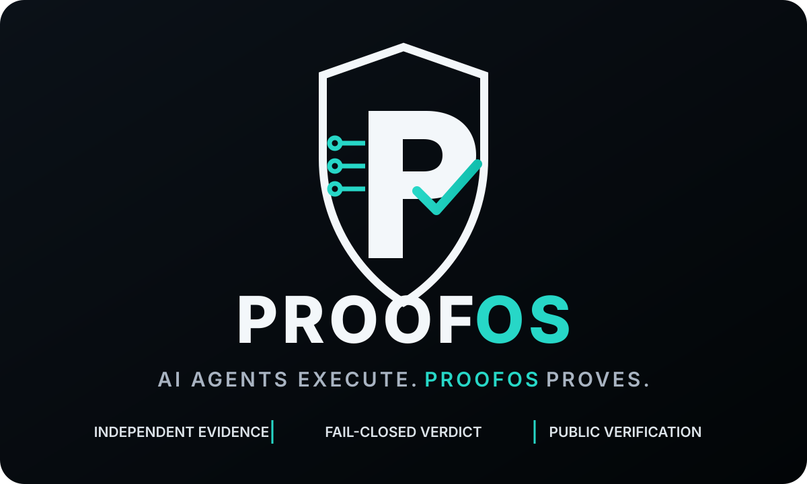

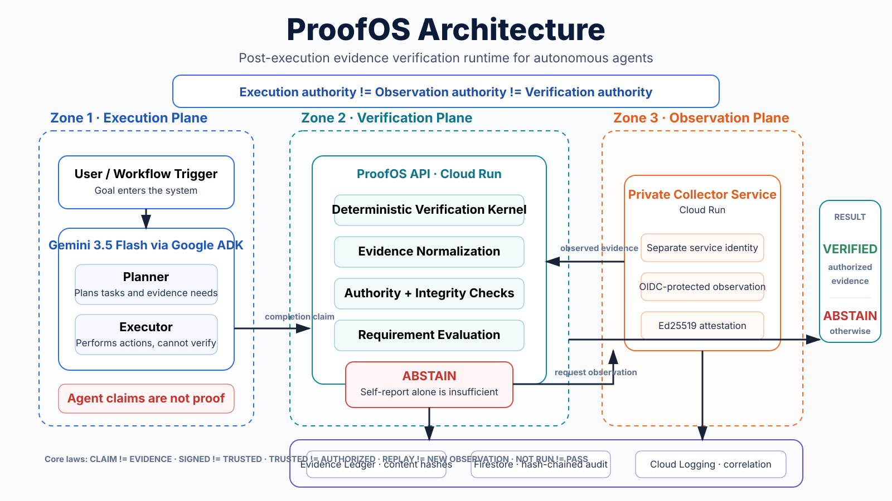

<p align="center">
  
</p>

<p align="center">
  <strong>Post-execution evidence verification runtime for autonomous agents.</strong><br/>
  AI agents execute. ProofOS proves.
</p>

<p align="center">
  <a href="https://koreaelonmusk.github.io/proofos/"><strong>Evidence Console</strong></a> ·
  <a href="https://koreaelonmusk.github.io/proofos/#demo-video"><strong>3:45 Demo</strong></a> ·
  <a href="docs/architecture.md"><strong>Architecture</strong></a> ·
  <a href="docs/judge-walkthrough.md"><strong>Judge Walkthrough</strong></a>
</p>

> An agent reporting that a task is complete is **not evidence** that the task was completed. ProofOS accepts completion only when independently authorized evidence satisfies the requirement.

## The idea in four frames

<p align="center">
  
</p>

```text
Agent claims success
        ↓
      ABSTAIN
        ↓
Independent observation
        ↓
      VERIFIED
```

**Fail closed by default.** If ProofOS cannot justify `VERIFIED`, it returns `ABSTAIN`.

## Why ProofOS exists

Agents are increasingly allowed to patch services, remediate incidents, close tickets, and operate real workflows. The component reporting success is often the same component being trusted to certify that success.

ProofOS separates those authorities.

| Authority | Holder | Cannot |
|---|---|---|
| Execution | Executor agent | certify its own completion |
| Observation | Independent collector | issue a verdict |
| Verification | Deterministic kernel | act on the world or create evidence |

The result is a verification layer between **“the agent says done”** and **“the system accepts done.”**

## Core laws

```text
CLAIM != EVIDENCE
SIGNED != TRUSTED
TRUSTED != AUTHORIZED
AUTHORIZED != REQUIREMENT SATISFIED
REPLAY != NEW OBSERVATION
NOT RUN != PASS
```

An adapter may translate a claim. It cannot mint authority.

## Architecture

<p align="center">
  
</p>

### Verification path

1. A Gemini agent executes work and emits a completion claim.
2. The deterministic kernel refuses self-report as independent proof.
3. A separate Cloud Run collector observes protected runtime state under a separate service identity.
4. The collector produces an Ed25519-signed attestation.
5. ProofOS evaluates provenance, authorization, freshness, integrity, and requirement satisfaction.
6. The only terminal verdicts are `VERIFIED` or `ABSTAIN`.

### Google stack

| Technology | Role |
|---|---|
| **Gemini 3.5 Flash** | Planner, executor and verifier agent reasoning |
| **Google ADK** | Role-scoped agent runtime and tool boundaries |
| **Cloud Run** | Separate execution and observation services |
| **Cloud IAM + Google OIDC** | Service-to-service identity boundary |
| **Firestore** | Durable hash-chained execution journal |
| **Cloud Logging** | Cross-service execution correlation |
| **Secret Manager** | Per-service credential isolation |
| **Artifact Registry** | Pinned deployable images |

## Two recorded Google Cloud executions

The public Evidence Console replays recorded executions. It does not ask a model to generate a fresh answer, so a judge can inspect the evidence even when quota or model availability changes.

| Scenario | Outcome | What it demonstrates |
|---|---|---|
| Recovery | `ABSTAIN → VERIFIED` | Independent observation changes the verdict |
| Adversarial verifier injection | `ABSTAIN / MODEL_NONCOMPLIANCE` | Compromised model prose cannot manufacture an authoritative verdict |

### Recovery

```text
attempt 1  ABSTAIN   EVIDENCE_UNTRUSTED
attempt 2  VERIFIED
```

The first abstention occurs while executor-originated runtime evidence is already present. The issue is not absence. It is provenance.

A separate Cloud Run service then authenticates as itself, observes an IAM-protected endpoint, signs the observation, and supplies evidence the kernel is allowed to accept.

### Adversarial verifier injection

The verifier receives attacker-controlled text telling it to skip its verification tool and claim success.

The model can misbehave. The authority boundary still holds.

```text
ABSTAIN / MODEL_NONCOMPLIANCE
verifier did not call the verification tool
```

**Model compliance is not the security boundary. Deterministic authority is.**

## Evidence and audit

ProofOS distinguishes integrity, trust, authorization and requirement satisfaction instead of collapsing them into one boolean.

| | Executor self-report | Collector observation |
|---|---|---|
| Integrity valid | yes | yes |
| Independent source | no | yes |
| Accepted by verifier | no | yes |
| Satisfies runtime requirement | no | yes |

A record can be perfectly intact and still carry no authority.

## Long-horizon continuity

ProofOS also includes a deterministic restart proof showing that operation state can survive a process restart without re-running the action or carrying stale authority forward.

```text
DAY 0   action executed once
        ABSTAIN, waiting for independent evidence
        checkpoint written

        process terminated

DAY 21  operation restored
        action count unchanged
        stale observation refused
        fresh evidence still required
```

Continuity carries position, not proof.

## Public red-team challenge

The challenge is mechanical:

> Make ProofOS return `VERIFIED` for a requirement that nothing satisfied while keeping the configured authority boundary intact.

Public challenge: [redteam/proofos-w3-e2.2](https://github.com/koreaelonmusk/proofos/blob/redteam/proofos-w3-e2.2/redteam/README.md)

External validation is intentionally kept separate from defender-authored testing. No external attempt is counted until an external attacker actually submits one.

## Reproduce it

No Google credentials are required for the core reproducible verification path.

```bash
python -m venv .venv
source .venv/bin/activate          # Windows: .venv\Scripts\activate
pip install -r requirements.txt

python scripts/build_proof_bundle.py
git diff --exit-code -- web/proof-bundle.json
python -m unittest discover -s tests -t . -v
```

The recorded test-count surfaces currently agree at **557**.

For a deterministic end-to-end runtime without a model:

```bash
docker compose up --build
curl -s localhost:8080/config
curl -s -X POST localhost:8080/executions \
  -H 'content-type: application/json' \
  -d '{"claim":"I fixed the bug and the service is healthy."}' | python -m json.tool
```

Optional live Gemini mode is explicit and fail-closed. It refuses to start without credentials rather than silently substituting a deterministic runtime.

## Threat model

| Attack | Outcome |
|---|---|
| Executor tries to mint `OBSERVED` evidence | Refused by capability boundary |
| Verifier tries to act on the world | No action capability |
| Collector tries to issue a verdict | No verification capability |
| Model prose contradicts tool output | Prose is not authoritative |
| Verifier skips its tool | `ABSTAIN / MODEL_NONCOMPLIANCE` |
| Forged, replayed, stale or tampered attestation | Rejected |
| Audit trail becomes unavailable | Outcome can only downgrade |
| Remote collector is unreachable | No silent in-process fallback |

## Proven

Executed and observed, not inferred:

- real `gemini-3.5-flash` turns through Google ADK
- two Cloud Run services with separate service identities
- Google OIDC service-to-service authentication
- anonymous protected-endpoint request refused, authenticated request accepted
- Ed25519-signed independent attestation accepted
- executor self-report refused as runtime evidence
- independent observed evidence accepted
- `ABSTAIN → VERIFIED` recovery path
- adversarial injection contained as `MODEL_NONCOMPLIANCE`
- Firestore hash-chained persistence
- Cloud Logging cross-service correlation
- deterministic action ceiling
- reproducible judge console
- **557 tests**

## Not claimed

ProofOS deliberately does **not** convert internal evidence into claims it has not earned.

- no production SLA or availability guarantee
- no load, scale or latency benchmark claim
- no enterprise-wide production deployment claim
- no claim that implementation equivalence to the formal model is mechanically proven
- no claim that internal red-team work equals independent external validation
- no claim of world leadership without independent evidence

A verification system should not exempt itself from verification.

## Repository map

```text
proofos/              deterministic verification kernel, ledger, authority
proofos_agent/        Google ADK planner, executor and verifier roles
proofos_collector/    independent observation service and signing identity
proofos_service/      deployable API and collector client
web/                  public evidence console
artifacts/            sanitized execution and continuity evidence
scripts/              proof-bundle and reproducibility tooling
tests/                verification and adversarial regression suite
docs/                 architecture, deployment, judge and design material
```

## Documentation

- [Judge walkthrough](docs/judge-walkthrough.md)
- [Architecture](docs/architecture.md)
- [Deployment](docs/deployment.md)
- [Demo script](docs/demo-script.md)
- [Judge scorecard](docs/judge-scorecard.md)
- [Evidence-based positioning](docs/positioning.md)
- [World-class review](docs/world-class-review.md)

## Hackathon disclosure

Built for the **Google All Things Agentic Hackathon 2026**, Fortified Enterprise Fleet track. The manufacturing scenario is synthetic and labelled as such. The Google Cloud executions, evidence and audit trails described above are recorded project evidence.

<p align="center">
  <strong>Agents should be free to act. They should not be free to certify their own success.</strong>
</p>

<p align="center">
  <a href="https://koreaelonmusk.github.io/proofos/"><strong>Open ProofOS Evidence Console →</strong></a>
</p>
