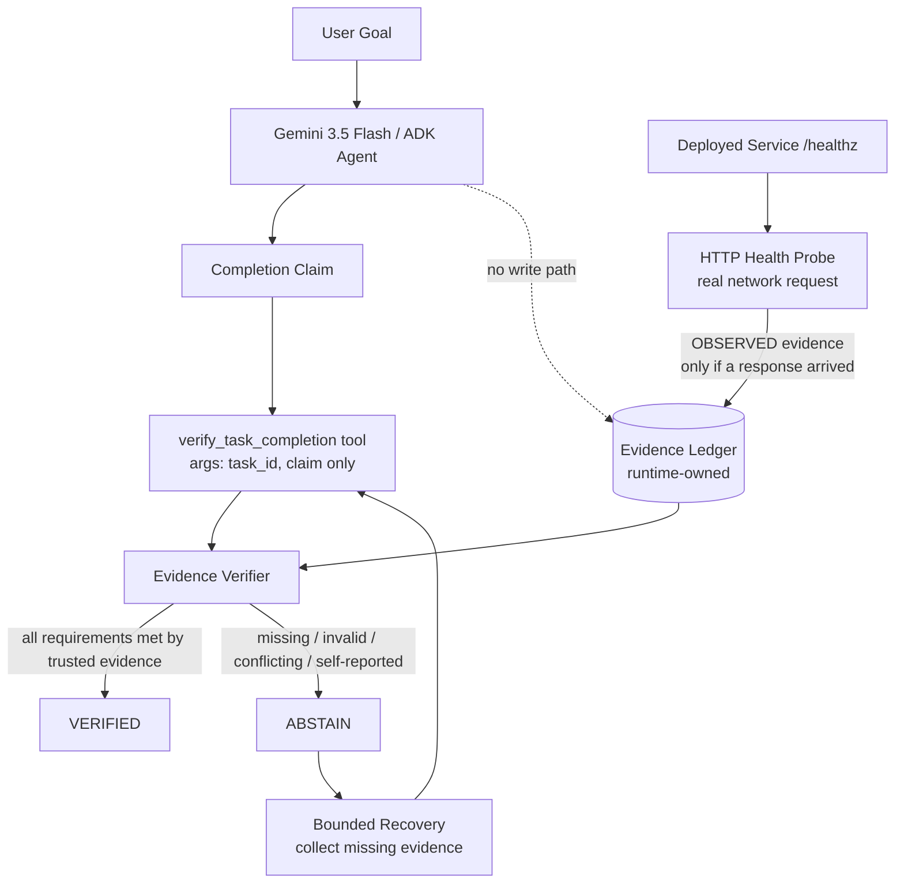

# ProofOS P0 Architecture

## Trust boundary

The executor's natural-language claim is **not evidence**.

Only independently observable evidence can satisfy a verification requirement.

The dashed edge above is the point that matters: the agent under scrutiny has no
write path into the ledger. It can name a task and state a claim. It cannot
declare what counts as proof, and it cannot assert that proof exists. The tool
schema Gemini sees exposes exactly two string parameters — `task_id` and
`claim` — so there is no channel through which the model can self-certify.

## Failure model

Every anomaly resolves to `ABSTAIN`, never to `VERIFIED`:

| Failure class | Trigger |
| --- | --- |
| `EVIDENCE_MISSING` | No evidence of a required kind; no declared requirements |
| `EVIDENCE_INVALID` | Evidence tampered, empty, conflicting, or a failed probe |
| `EVIDENCE_UNTRUSTED` | Evidence present but only `EXECUTOR` / `MODEL` sourced |
| `MALFORMED_INPUT` | Malformed claim, malformed evidence item, unknown task |
| `VERIFIER_FAILURE` | Unexpected exception inside the verifier |

A verifier that crashes must never be read as success.

## Recovery

An `ABSTAIN` names the unsatisfied evidence kinds. Recovery attempts to collect
exactly those and re-verifies. The loop terminates on `VERIFIED`, on an
exhausted retry budget, or when no collector exists for what is missing. It
never converts a failure into a success.

## Current P0

The verification kernel, the ledger trust boundary, the ADK tool wiring, and the
bounded recovery loop are implemented and covered by tests. The live Gemini
execution path is implemented but not yet proven — it requires credentials.
Cloud Run deployment and durable persistence are the next milestones.
