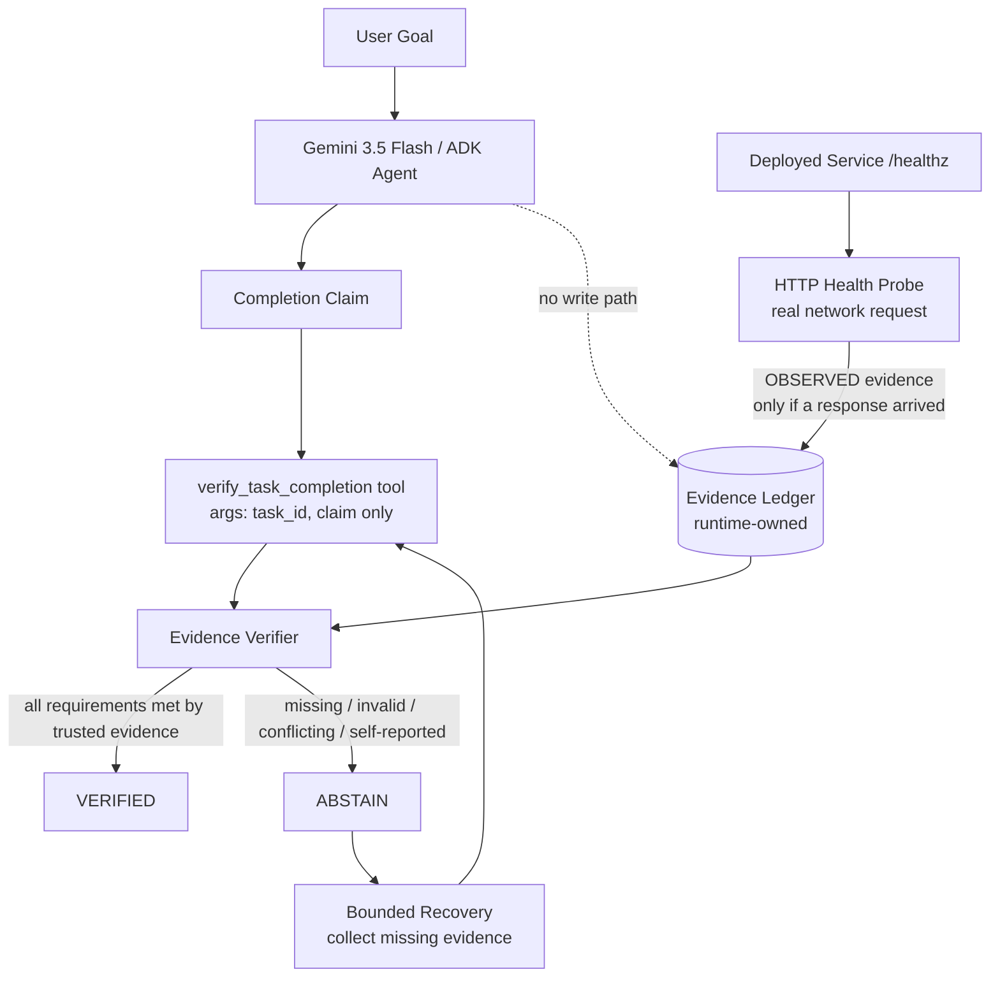

# ProofOS P0 Architecture



## Trust boundary

The executor's natural-language claim is **not evidence**.

Only independently observable evidence can satisfy a verification requirement.

The dashed edge above is the point that matters: the agent under scrutiny has no
write path into the ledger. It can name a task and state a claim. It cannot
declare what counts as proof, and it cannot assert that proof exists. The tool
schema Gemini sees exposes exactly two string parameters — `task_id` and
`claim` — so there is no channel through which the model can self-certify.

## Failure model

Every anomaly resolves to `ABSTAIN`, never to `VERIFIED`:

| Failure class | Trigger |
| --- | --- |
| `EVIDENCE_MISSING` | No evidence of a required kind; no declared requirements |
| `EVIDENCE_INVALID` | Evidence tampered, empty, conflicting, or a failed probe |
| `EVIDENCE_UNTRUSTED` | Evidence present but only `EXECUTOR` / `MODEL` sourced |
| `EVIDENCE_STALE` | Observation older than the requirement's horizon, or undated |
| `EVIDENCE_TAMPERED` | A record no longer matches its own content hash |
| `MALFORMED_INPUT` | Malformed claim, malformed evidence item, unknown task |
| `VERIFIER_FAILURE` | Unexpected exception inside the verifier |

A verifier that crashes must never be read as success.

## Audit trail

Every execution appends immutable events to a journal covering the claim, each
tool call, each verification decision, each recovery attempt, and every
observation collected or rejected. Events carry `execution_id`, `trace_id`,
`task_id`, agent, status, and a SHA-256 of their own content.

Replaying an execution reconstructs the decision without trusting any agent's
summary. Events are emitted as single-line JSON with a `severity` field, which
Cloud Logging ingests from stdout on Cloud Run without a client library.

Orchestrator-level failures are distinguished: `MODEL_NONCOMPLIANCE` when the
agent never called the verifier, `COLLECTOR_UNAVAILABLE` when nothing can obtain
the missing evidence, `RETRY_EXHAUSTED` when the budget ran out.

## Recovery

An `ABSTAIN` names the unsatisfied evidence kinds. Recovery attempts to collect
exactly those and re-verifies. The loop terminates on `VERIFIED`, on an
exhausted retry budget, or when no collector exists for what is missing. It
never converts a failure into a success.

## Deployment shape

```text
Cloud Run service (proofos_service.app)
  GET  /healthz                     health, in the probe's contract shape
  POST /executions                  bounded verify -> recover -> re-verify
  GET  /executions/{execution_id}   audit replay
```

The service's health endpoint satisfies the probe contract, so a deployed
ProofOS can be the target of a real probe rather than a simulated one. The probe
runs in a worker thread: blocking it on the event loop would stop the service
answering the request it is trying to observe.

Each execution owns its own ledger. A shared one would let one request's
evidence satisfy another request's claim.

## Current P0

The verification kernel, the ledger trust boundary, the ADK tool wiring, and the
bounded recovery loop are implemented and covered by tests. The live Gemini
execution path is implemented but not yet proven — it requires credentials.
Cloud Run deployment and durable persistence are the next milestones.
