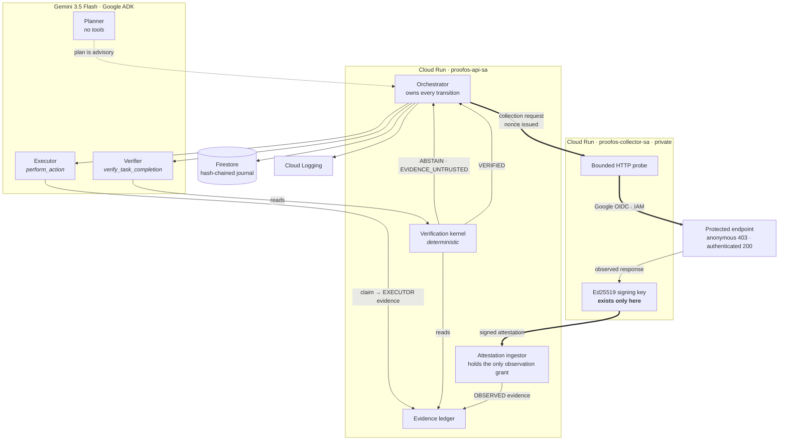
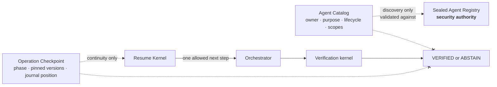

# ProofOS architecture

Two services, three authorities, one invariant: no claim of completion without
independent evidence.

This page describes the deployed system. The normative contracts live beside it:

| Document | Answers |
|---|---|
| [Trust boundaries](trust-boundary.md) | who may do what, and the transport authority matrix |
| [Evidence lifecycle](evidence-lifecycle.md) | what `VERIFIED` and `ABSTAIN` mean, and where authority first appears |
| [Proof bundles](proof-bundles.md) | portable proof and offline replay |
| [Signed attestations](attestations.md) | what a signature proves, and what it does not |
| [Threat model](threat-model.md) | attacks, responses, and the test enforcing each |
| [Integration guide](integrations.md) | the two paths to the verifier, and the patterns to avoid |
| [Operator runbook](operator-runbook.md) | requirements, collectors, replay, and every failure code |
| [Repository governance](governance.md) | lease and worktree discipline for concurrent writers |

## What ProofOS does not prove

Listed first, because a system that only advertises its wins is marketing.

- **That an agent is honest.** ProofOS never forms a view about an actor. It
  asks whether independent evidence satisfies declared requirements.
- **That a model is correct.** Model compliance is not a security boundary.
  A verifier model that ignores its tools produces `ABSTAIN`, not a verdict.
- **World truth in the absence of evidence.** `ABSTAIN` means nothing was shown,
  not that the task failed. A perfectly healthy service abstains if nobody
  independent looked.
- **Current truth from a historical replay.** Replay reproduces a decision. It
  never observes. Re-evaluating sealed evidence against a newer clock is a
  different question with a different name, and old evidence goes stale.
- **That signed data is true.** A valid signature proves who signed some bytes.
- **That an authenticated actor is honest.** Authentication establishes who is
  speaking, and nothing about what was said.
- **That several relays are several observations.** A claim passed through three
  agents is one claim wearing three names.
- **That successful transport means a successful task.** HTTP 200, a green CI
  check, an A2A `completed` state and an ADK success callback are all claims.
- **That CI success satisfies an arbitrary runtime requirement.** A green build
  is evidence about a build.
- **That bundle integrity establishes collector trust.** The digest says the
  bytes are unaltered. Who to believe is a separate input.
- **Production readiness, SLA, availability, or performance.** No load, scale or
  latency claim is made anywhere in this repository.

## The whole system

## Continuity, kept away from authority

Neither the catalog nor the checkpoint has a path to a verdict, and the dashed
crossed edges are the point of the diagram. A card is validated against its
registry record at build time, so catalog metadata cannot grant a capability the
registry withheld. A checkpoint has no field that could hold a decision,
evidence content, or a capability -- there is nothing in it a forgery would buy.

The resume kernel is a railway switch. Given a checkpoint it reports exactly one
permitted next step, and an operation whose journal records `ACTION_EXECUTED`
can never be switched back onto the execution track, whatever its checkpoint
says. The journal is the authority on what happened; the checkpoint only says
where to look.

## Trust boundaries

### 1. The executor cannot write evidence that counts

The executor holds a `ClaimCapability` whose `source` is hard-coded to
`EXECUTOR`. There is no parameter to override it and no second method. Reaching
the ledger by any route buys nothing: `EvidenceLedger.record` refuses `OBSERVED`
without a matching `ObservationGrant`, and the grant names the issuer, the
evidence kinds, and the collector identity it authorises.

This is enforced by object graph, not by prompt. The executor is handed no
ledger, no observation capability, no read access to evidence, and no verifier.
An executor that decides to cheat has nothing to cheat with.

### 2. The API cannot author an observation

The signing key exists only in the collector process. The API holds the public
key and can verify an attestation; it cannot produce one. Eleven checks run on
ingestion — signature, execution binding, task binding, collector identity,
profile, nonce, freshness, duplicate, outcome, kind, and canonical re-encoding
of every signed field.

`source` is never transmitted. It is assigned by the ingestor after verification
succeeds, so a collector cannot request its own provenance level.

### 3. The model narrates; it does not decide

Verdicts come from the verification tool's return value. `decision_from` reads
the tool result and refuses to guess when the turn is ambiguous: no tool call, a
call for a different task, or a call with no result are all
`MODEL_NONCOMPLIANCE`. A verifier that writes "VERIFIED" over an `ABSTAIN` tool
result has narrated, not decided.

This is what contained the live injection in `exec_f34d136adf9140f9`.

### 4. Two services, not two classes

Process-local separation is a promise. Separate Cloud Run deployments, separate
service accounts, and IAM-gated invocation are observable facts: an anonymous
request to the protected endpoint returns `403`, and the collector's identity is
explicitly authorized to invoke it.

## Why the collector has no agent

Its job is a bounded network probe. Putting a language model in front of it
would insert an untrusted step into the one path that has to stay observable.
The collector is deterministic on purpose.

## Evidence rules

A requirement is satisfied only when the most recent trusted observation of that
kind is valid, intact, non-empty, and within the requirement's freshness
horizon.

- **Provenance.** Only `OBSERVED` satisfies. `EXECUTOR` and `MODEL` are recorded
  and refused.
- **Supersession.** The latest trusted observation governs. An older failed
  probe does not veto a service since observed healthy; a newer failed probe
  does veto an earlier success.
- **Freshness.** Declared per requirement, because a health probe speaks for the
  moment it ran and a recorded test run speaks for the commit it describes.
- **Integrity.** Every record carries its own content hash. A record that no
  longer matches its digest fails the whole set closed.

## Reporting

Three separate facts, never collapsed:

| Field | Question |
|---|---|
| `integrity_valid` | Is the record internally sound? |
| `accepted_by_verifier` | Did it survive the trust policy for a requirement of its kind? |
| `satisfies_requirement` | Was it among the items that actually settled the requirement? |

All three come from the same verifier pass that produced the verdict. The
presentation layer joins on `evidence_id` and copies; it holds no trust rules of
its own. Acceptance belongs to an attempt, so the response carries `attempts[]`.

## Failure semantics

Every failure resolves to `ABSTAIN` with a named class. There is no path that
resolves to success on doubt.

| Class | Cause |
|---|---|
| `EVIDENCE_MISSING` | No evidence of a required kind |
| `EVIDENCE_UNTRUSTED` | Present, but self-reported |
| `EVIDENCE_INVALID` | Governing observation reports failure or is empty |
| `EVIDENCE_STALE` | Outside the requirement's freshness horizon |
| `EVIDENCE_TAMPERED` | A record no longer matches its own digest |
| `MODEL_NONCOMPLIANCE` | No authoritative tool result to read |
| `CAPABILITY_DENIED` | A component attempted something it does not hold |
| `AUDIT_UNAVAILABLE` | The decision could not be durably recorded |
| `COLLECTOR_UNAVAILABLE` | No collector for the missing evidence |
| `RETRY_EXHAUSTED` | Bounded attempts ran out |
| `VERIFIER_FAILURE` | The kernel itself raised |

## Journal

Append-only, hash-chained. Each event carries `sequence`, `previous_hash`, and a
content hash over its own fields. Firestore writes are transactional with an
idempotency index, and reads sort by explicit `sequence` rather than document
order. Edits, gaps, duplicates, and reordering are all detectable.

Losing the journal cannot manufacture a success: an unwritable audit trail
downgrades the outcome to `ABSTAIN / AUDIT_UNAVAILABLE`.
