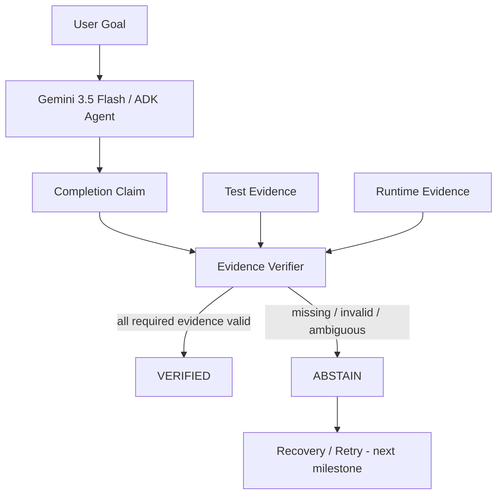

# ProofOS P0 Architecture

## Trust boundary

The executor's natural-language claim is **not evidence**.

Only independently observable evidence can satisfy a verification requirement.

## Current P0

The verifier contract is implemented and deterministic. The live Gemini/ADK and Cloud Run execution path is the next milestone.
