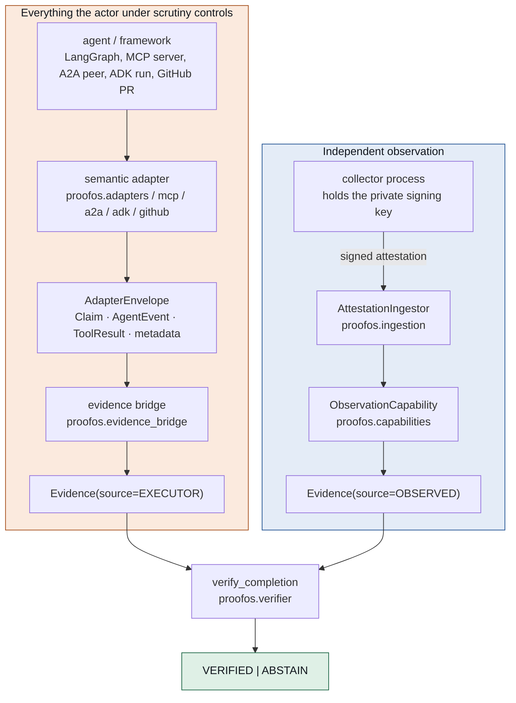

# Trust boundaries

This document describes what the implementation already enforces. It does not
grant authority; it maps where authority already lives. Where this page and the
code disagree, the code is correct and this page is a bug.

## Three authorities that are usually one

| Authority | Held by | Cannot |
|---|---|---|
| Execution | the agent under scrutiny | record `OBSERVED` evidence, or reach a verdict |
| Observation | a registered collector holding an `ObservationCapability` | reach a verdict |
| Verification | `proofos.verifier`, a deterministic kernel | act on the world, or write evidence |

A claim therefore cannot promote itself. The only outcomes are `VERIFIED` and
`ABSTAIN`, and the default is refusal.

## The canonical model



The boundary is the gap between the two subgraphs. Nothing on the left reaches
`OBSERVED`, and the reason is structural rather than procedural: the left-hand
modules do not import the types that would let them.

Five distinctions the diagram exists to keep apart:

- **adapter ≠ observer.** An adapter translates a dialect. It never witnesses.
- **transport ≠ authority.** How a statement arrived says nothing about it.
- **signature ≠ trust.** See [attestations](attestations.md).
- **trust ≠ requirement satisfaction.** A trusted collector's observation of the
  wrong kind, or an old one, still leaves a requirement unmet.
- **recorded verdict ≠ replay authority.** See [proof bundles](proof-bundles.md).

## Transport authority matrix

Every transport carries statements. None carries authority.

| Transport | Carries claims | Carries metadata | Carries signed attestation | Creates `EXECUTOR` evidence | Creates `OBSERVED` evidence | Verifies | Grants capabilities | Determines verdict |
|---|---|---|---|---|---|---|---|---|
| Python (`proofos.adapters.PythonAdapter`) | yes | yes | no | no | no | no | no | no |
| HTTP (`proofos.adapters.HttpAdapter`) | yes | yes | no | no | no | no | no | no |
| GitHub (`proofos.github`) | yes | yes | no | no | no | no | no | no |
| MCP (`proofos.mcp`) | yes | yes | no | no | no | no | no | no |
| A2A (`proofos.a2a`) | yes | yes | no | no | no | no | no | no |
| ADK (`proofos.adk`) | yes | yes | no | no | no | no | no | no |
| Proof bundle (`proofos.bundle`) | yes | yes | yes | no | no | no | no | no |

The `EXECUTOR` column is `no` for every row on purpose. Encoding a normalized
submission as evidence is a separate, explicit step performed by
`proofos.evidence_bridge.evidence_from_envelope`, which is not a transport and
does not import one. That module writes `EvidenceSource.EXECUTOR` and has no
branch that reaches `OBSERVED`.

A proof bundle *carries* a signed attestation. Verifying one is
`proofos.portable_attestation.verify_portable`, against a registry the replaying
environment supplies.

Enforced by `tests/test_transport_equivalence.py`, which puts one statement
through five transports and asserts a single set of truth semantics and a single
verdict, and by the per-adapter suites `tests/test_mcp.py`, `tests/test_a2a.py`,
`tests/test_adk.py`, `tests/test_github.py`.

## `claimed_by_sender`

Everything a sender asserted lives under one key:

```
metadata
├─ transport            adapter-owned fact
├─ adapter_id           adapter-owned fact
├─ server_id            adapter-owned fact
└─ claimed_by_sender    everything the other party asserted
     ├─ source
     ├─ collector_id
     ├─ trusted
     ├─ verified
     ├─ status
     ├─ authority
     └─ …
```

> **Who said it is metadata. Whether it is true is not.**

The namespace is not a convention. `AdapterEnvelope.__post_init__` refuses to
construct an envelope whose metadata carries a top-level `source`,
`collector_id`, `trusted`, `independent`, `authority`, `verdict`, `verified` or
`status`, and refuses any other key beginning with `claimed_`. An adapter that
forgets cannot ship.

The alternative — a naming convention like `claimed_source` — needs a new entry
every time a new dangerous word appears. A rule that grows one item per threat
is a rule that will one day be one item short.

Defined in `proofos.adapters` (`CLAIMED_NAMESPACE`, `RESERVED_METADATA_KEYS`,
`claimed_by_sender`); enforced by
`tests/test_adapters.py::CanonicalSenderMetadataTests`.

## Where authority first appears

Reading the lifecycle in [evidence-lifecycle.md](evidence-lifecycle.md), the
first point at which anything gains authority is
`ObservationCapability.record_observation`. Everything before it is translation,
encoding and checking. That method is reachable only by holding the capability
object, which is issued by an `EvidenceLedger` and only before that ledger is
sealed.

The limit is worth stating plainly, and `proofos/ledger.py` states it in the
source: code running in the same interpreter can still reach a grant by
introspection if it holds a reference to something that holds one. What the
design prevents is a component writing evidence it was never given authority for
— by accident, by refactor, or by an agent whose only reach is its declared
tools. Genuine isolation against arbitrary in-process code requires process
separation, which is why the collector is a separate service.

## See also

- [Evidence lifecycle](evidence-lifecycle.md)
- [Proof bundles and offline replay](proof-bundles.md)
- [Signed attestations](attestations.md)
- [Threat model](threat-model.md)
- [Integration guide](integrations.md)
